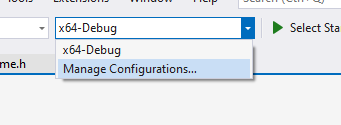
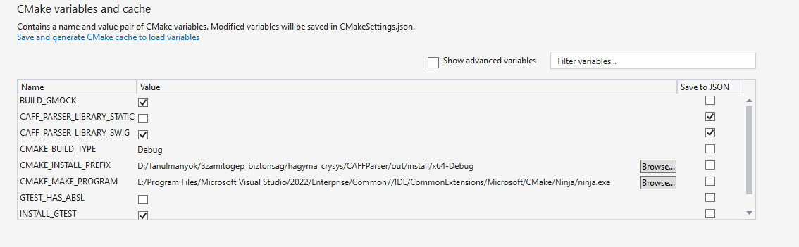

# CAFF parser program/library

## Building
1. The Google Test submodule has to be loaded by the following command:
```bash
$> git submodule update --init --recursive
```

2. The project can be built by the following command:
```bash
$> cmake . -D=CAFF_PARSER_LIBRARY_STATIC=ON && make
```

### Building dynamic library
```bash
$> cmake . -D=CAFF_PARSER_LIBRARY_STATIC=OFF && make
```

### Building a SWIG library
1. Download the SWIG
    - for Windows: [https://www.swig.org/download.html](https://www.swig.org/download.html)
    - for Linux:
        ```bash
        sudo apt install swig
        ```
2. Set the `SWIG_DIR` and `SWIG_EXECUTABLE` environment variables (Only for compiling with MSVC)
    - `SWIG_DIR`: \<path-to-swig-library\>/Lib
    - `SWIG_EXECUTABLE`: \<path-to-swig-library\>/swig.exe
3. Build library
    ```bash
    $> cmake . -D=CAFF_PARSER_LIBRARY_SWIG=ON && make
    ```

### Build library in Visual Studio
1. Download SWIG and set the necessary enviroment variables according to the `Building a SWIG library` section.
2. Open the `CAFFParser` folder in Visual Studio
3. Then you can set the previously mentioned options:


4. After choosing the needed config you can build the solution

## Running
__This section is only relevant if you built static or dynamic library.__

The program can be run:
```
$> ./CAFFParser_run <caff file> -o <ppm file to generate> <json file to generate>
```